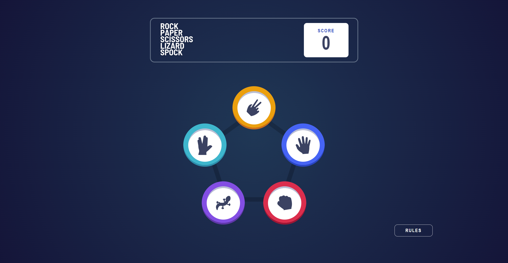
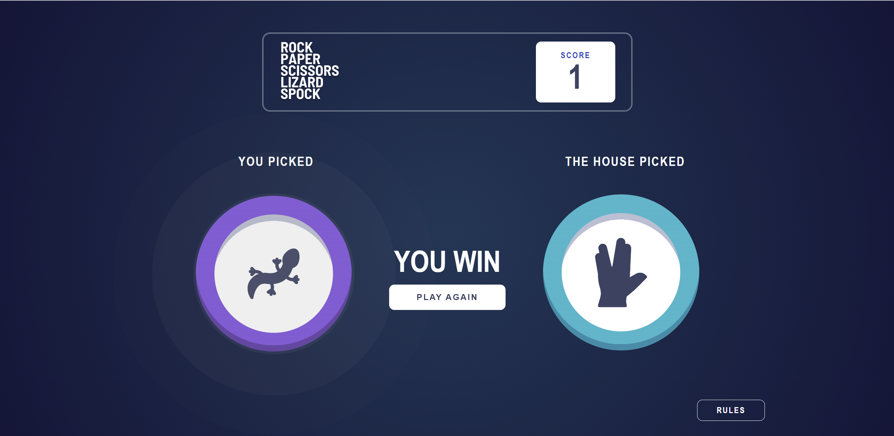
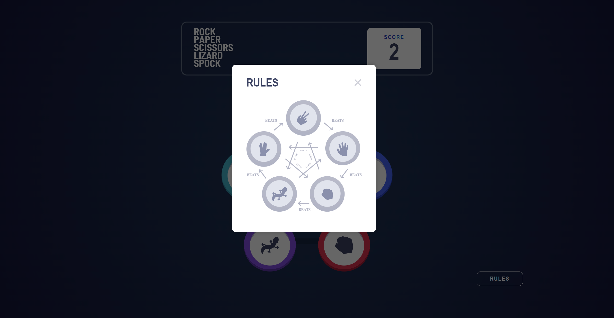
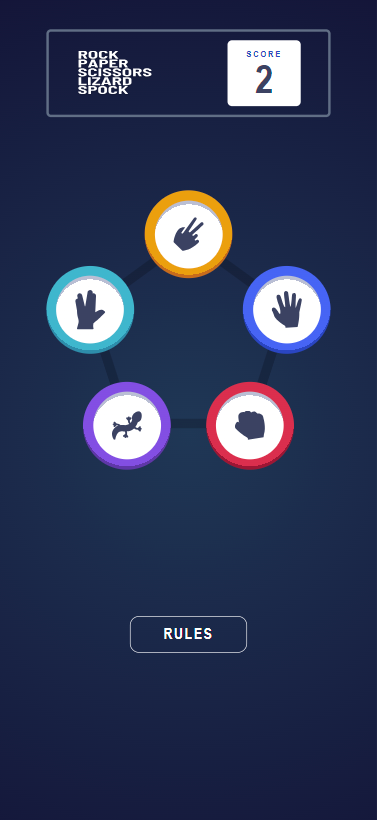
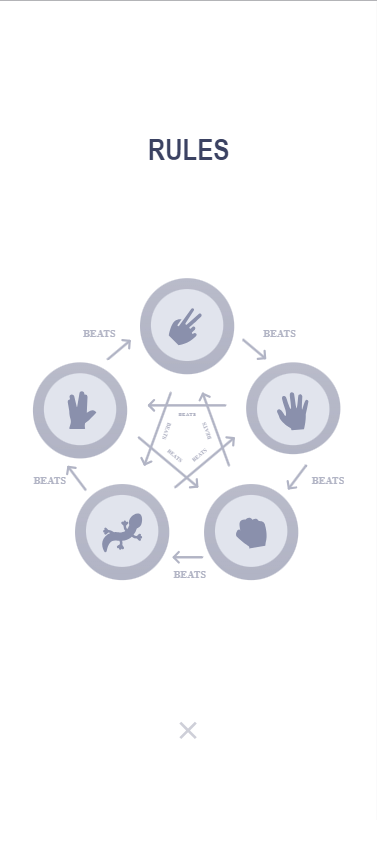
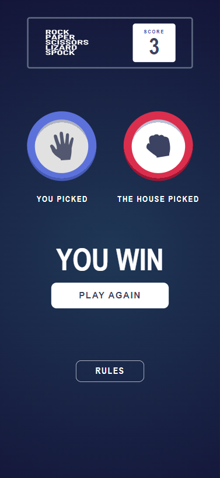

# Frontend Mentor - Rock, Paper, Scissors solution

This is a solution to the [Rock, Paper, Scissors challenge on Frontend Mentor](https://www.frontendmentor.io/challenges/rock-paper-scissors-game-pTgwgvgH). Frontend Mentor challenges help you improve your coding skills by building realistic projects.

## Table of contents

- [Overview](#overview)
  - [The challenge](#the-challenge)
  - [Screenshot](#screenshot)
- [My process](#my-process)
  - [Built with](#built-with)
  - [What I learned](#what-i-learned)
  - [Continued development](#continued-development)
  - [Useful resources](#useful-resources)
- [Author](#author)

## Overview

### The challenge

Users should be able to:

- View the optimal layout for the game depending on their device's screen size
- Play Rock, Paper, Scissors against the computer
- Maintain the state of the score after refreshing the browser _(optional)_
- **Bonus**: Play Rock, Paper, Scissors, Lizard, Spock against the computer _(optional)_

### Screenshot








## My process

### Built with

- Semantic HTML5 markup
- CSS custom properties
- JS library
- React framework

### What I learned

```html
<div className="resultBorder2">
  {userOption === "rock" && (
  
  )} {userOption === "paper" && (
  
  )} {userOption === "scissor" && (
  
  )} {userOption === "lizard" && (
  
  )} {userOption === "spock" && (
  
  )}
</div>
```

```css
.pulse-delay:nth-child(1) {
  animation-delay: 0.4s;
}

.pulse-delay:nth-child(2) {
  animation-delay: 0.8s;
}

.pulse-delay:nth-child(3) {
  animation-delay: 1.4s;
}

@keyframes pulse {
  100% {
    opacity: 0;
    transform: scale(2.2);
  }
}
```

```js
// Define a unique prefix for this app's local storage
const localStoragePrefix = "rockPaperScissorsBonus_";

// Initialize score state with the value retrieved from local storage or default to 0
const [score, setScore] = useState(
  parseInt(localStorage.getItem(localStoragePrefix + "score")) || 0
);

//function to reset game
function resetGame() {
  setUserOption(null);
  setComputerOption(null);
  setResult(null);
  setAnimate(false);
  setReadyToAnimate(false);
  setShowCenterContent(false);
}

// Function to handle modal toggle
function toggleModal() {
  setShowModal(!showModal);
}
```

### Continued development

Bootstrap
-I want to get familier with this to build responsive site for desktop and mobile

Javascript
-I still have a lots that need to learn how to use the unknown function to use in the program.

### Useful resources

- https://www.w3schools.com/ - You can see a example and explanation here about html/css and javascript.
- https://www.youtube.com/ - You can go through the video to learn how to do the project.
- https://www.google.com/ - You can seach anything you want to know.

## Author

- Website - [Tan Carlven](https://carlven-rock-paper-scissors-bonus.netlify.app)
- Frontend Mentor - [@carlven0830](https://www.frontendmentor.io/profile/carlven0830)
- Twitter - [@carlven30](https://twitter.com/carlven30)

**Note: Delete this note and add/remove/edit lines above based on what links you'd like to share.**
